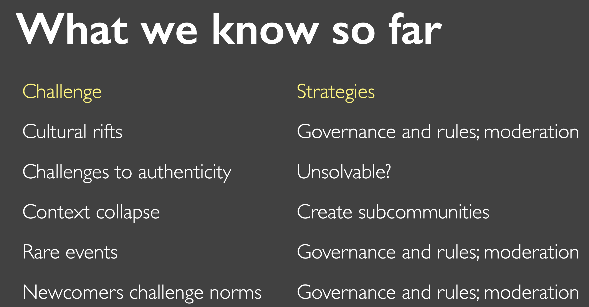
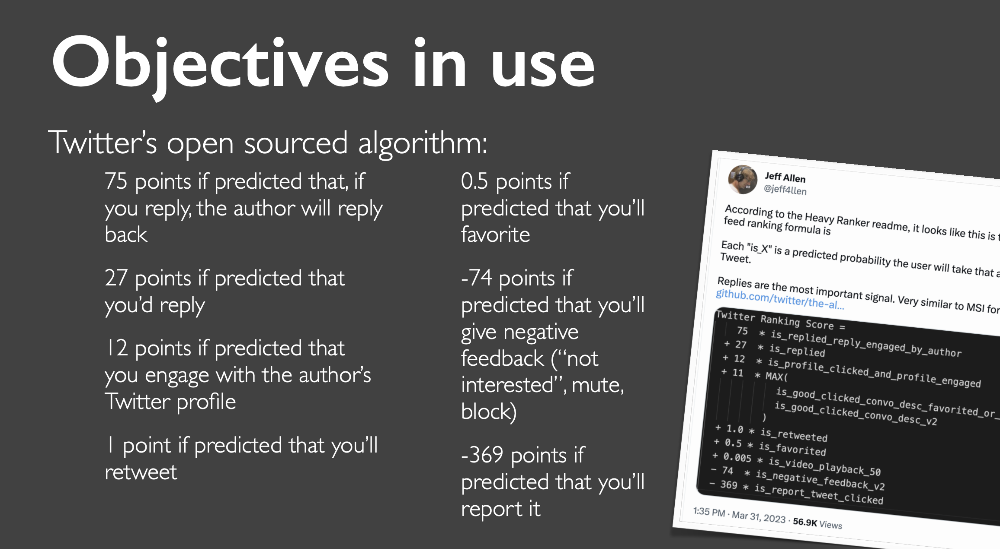
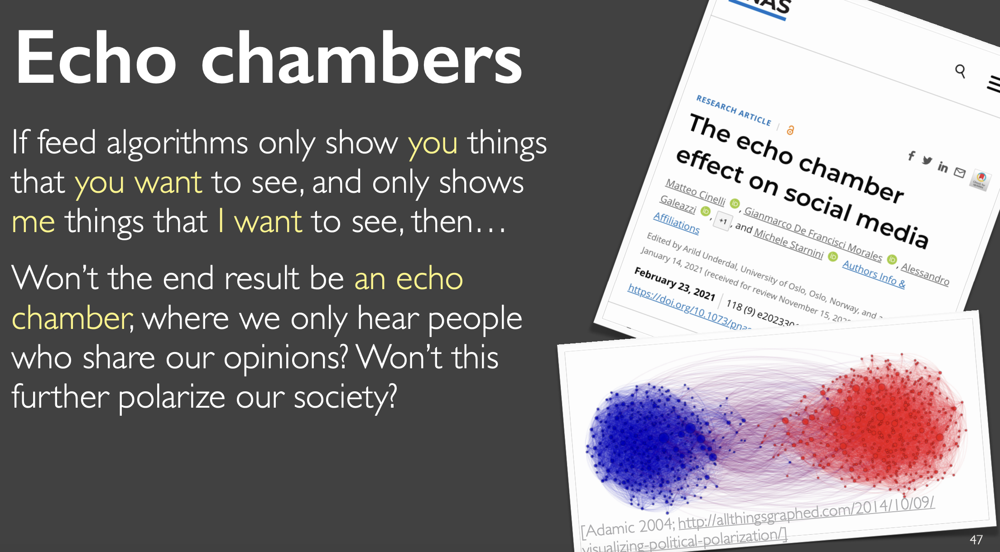
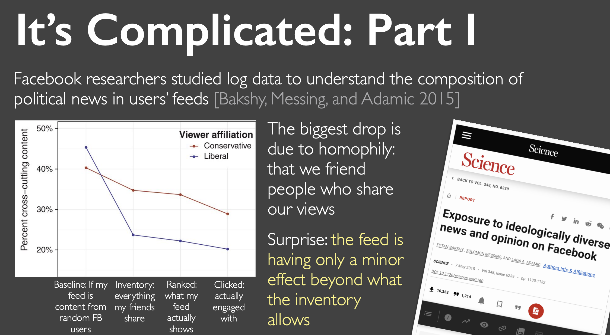
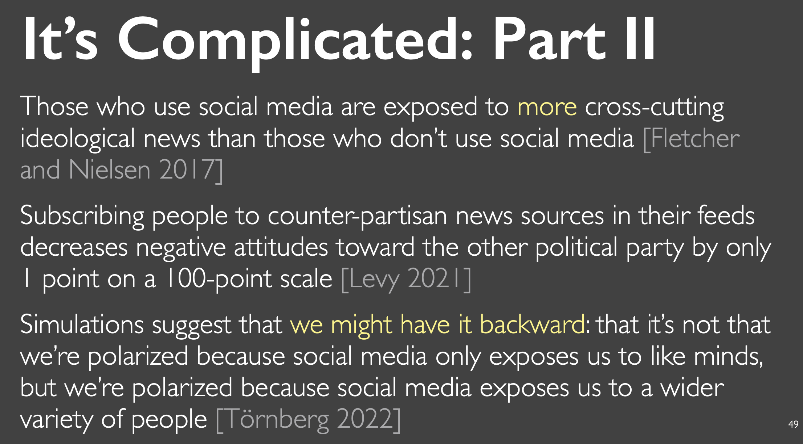
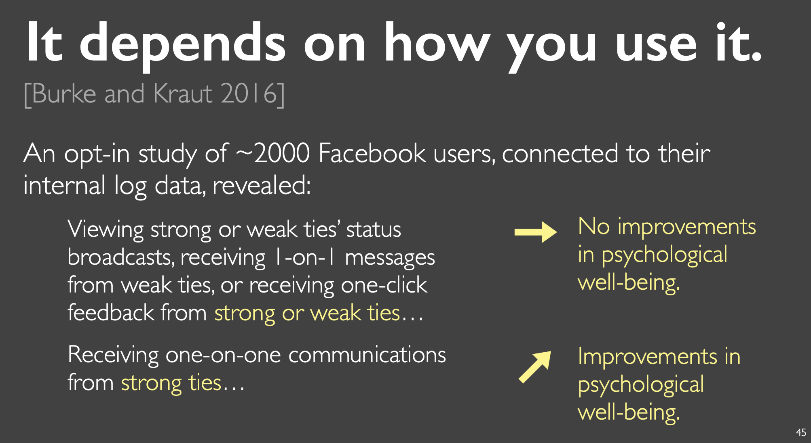
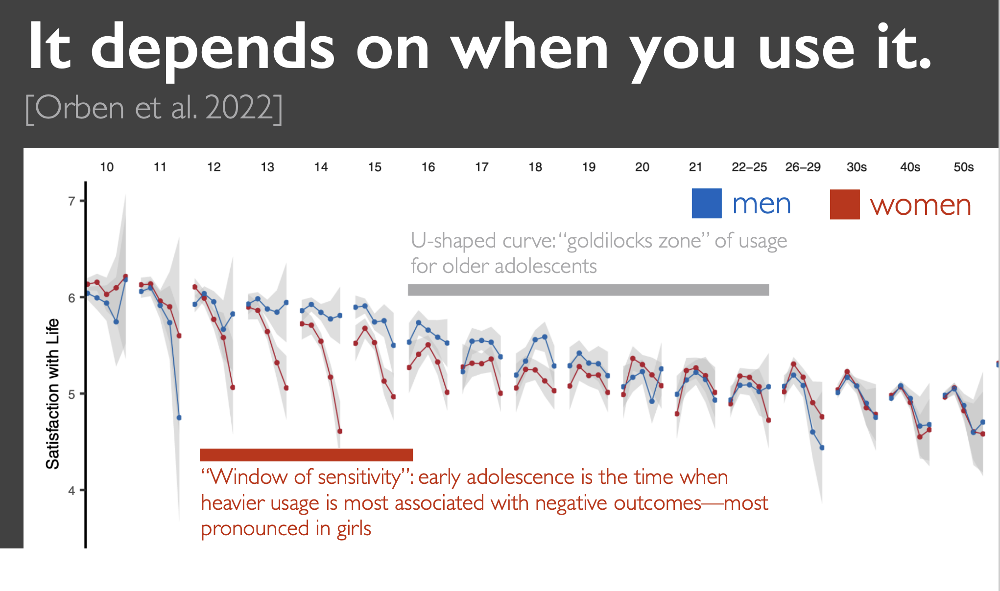

# Stanford-CS278

## Week 1
 
### Social proof: 
when people copy each others’ behavior
In social situations when people are 
unable to determine the appropriate 
behavior, they look to what others are 
doing. 
The assumption is that others know 
what they are doing, so their behavior 
becomes a kind of proof

### Channel factors: 
minor features upstream in a decision process that 
can produce large changes in behavior downstream [Ross and 
Nisbett 1991]. They are behavioral catalysts.
Students asked to get a tetanus shot were more likely to do it if they got 
a map to point out where the health center was, and a written list of its 
hours of operation. They already knew both of these facts. [Leventhal et 
al. 1965
E.g Like button

### Social Loafing:
Many hands make…work…light?
When there are others contributing, we contribute less.
Experiment: blindfold a participant and get them to play team tug war. [Ingham 1974]
Except…there is actually nobody else on their team, they just think so. 
(Remember, they’re blindfolded.)
People pulled 18% harder when they thought they were the only one on 
their team than when they thought there were 2–5 others

### Reciprocity:
You are more willing to give back when someone does a favor for 
you. Even if you didn’t ask for the favor!
Experiment [Regan 1971]: in the context of another task, your 
partner goes out for a bathroom break.They either come back as 
normal, or bring a soda back for you. 
Participants in the unasked-for soda condition later bought more raffle 
tickets for their partners

## Week 2

### Norms:
Describe common behavior, what one should or should not do. 
We intuit norms quickly. It has a HUGE impact on our behavior, even larger than the person himself.

### Stack Overflow's example:

The founders launched in a small private beta 
with 500 enthusiastic community members for 
three months before opening to everyone

What happened? By the time the site launched publicly, it was full 
of positive examples of technical questions 
answered helpfully and succinctly, which set the 
expectation.

For new users: 
Legitimate peripheral participation [Lave and 
Wenger 1991]: new members begin with low risk tasks while they absorb norms. On Stack 
Overflow, new users cannot up/downvote, edit 
questions and answers — only ask and answer

What happened: Users learn what kinds of questions and 
answers are valued before they can vote

There are downsides as well.

### Defaults influence norms:
Very few users change defaults: only 5% of Microsoft Word users in 
one study had ever changed any settings [Spool 2011]; only 19% 
changed the default public calendar setting [Palen 1999]
Why? Recall: Channel factors. (Amongst other reasons.)
Think about the defaults you encounter in social computing systems
Who do you share with by default on Facebook?
What’s the default sort order of posts?
What’s the default skin color of emoji?

### Anonymity:

create greater disinhibition, which results in 
more trolling, negative affect, antisocial behavior, and conformity to norms.

On the other hand, anonymity can foster stronger communal identity 
[Ren, Kraut, and Kiesler 2012] and more creativity [Jessup, Connolly, and 
Galegher 1990

Summary: anonymity and pseudonymity are 
playing with �. But, real name requirements 
can put victims of abuse and others at risk

### Unintended consequences:
Facebook’s design to connect people instead resulted in separation.
This reversal is not unique to Facebook — we’ll continue to cover it:
Twitter crowdsourced disinformation identification in 2021, but initially it 
was heavily used by political groups to flag their opponents’ tweets
SFUSD deployed an algorithm to more fairly assign students to schools, 
but it increased segregation: not all groups have access to information on 
how to navigate the algorithm [Robertson, Nguyen, and Salehi 2021]
Facebook opened up its API to great fanfare…but Cambridge Analytica.
<<<<<<< HEAD
Twitter empowers end user news via the Arab Spring…but fake news.

### Prototyping:
Tons of lessons already to avoid "just build it" pitfall. Prototypes should focus laserlike on what’s the big risky unanswered question about the idea. Typically, that question is not whether the interface is usable. It’s how 
the social dynamics will play out

Don’t build the entire technical stack just to answer a question. 
Instead, piggyback on existing social computing systems that get you 
similar affordances. [Grevet and Gilbert 2015]
In other words, layer your design on top of existing social platforms 
to prototype the social interactions.
Push messaging? Use texts.
Collaboration? Use GDocs or GSlides.
Chat? Use Slack or GroupMe.
In HCI parlance, piggyback prototyping can be thought of as a specific 
method for experience prototyping. [Buchenau and Suri 2000]

Prototype “the hard side”
[Chen 2022]
Think critically: whose contributions will be the most challenging to 
recruit?
in a student+faculty forum, it’s hardest to get faculty to reply
in tiktok or wikipedia, it’s the content creators
in an art feedback forum, it’s: the artists, or the feedback givers?
My take: it’s the feedback givers: they are the scarce resource
Nearly every system has different roles: always prototype the role 
representing “the hard side” — if that part fails, the whole thing fails 2

### Cold Start:
the social computing system isn’t really very enjoyable 
or useful to anybody when nobody’s there yet.
…but then, why would someone join and start populating it, if 
there’s nobody there.

Going broad, and trying to get all users at once, typically fail.

Building a focused, engaged core initially is better design.
Why?
- The designer has a clear sense of who the users are,
what issues they face, and what norms they expect
- Cliques help overcome the cold start problem
- This an “atomic network”: aim to create the smallest 
stable, self-sustaining group possible

Eg. Alex Wolf (bossbabe.com): kickstart by creating 
a social space that affirms a group’s sense of 
identity
Look for micro-cultures, e.g., a trend of millennial 
women graduating from college and not wanting 
to go the traditional route of subverting their 
femininity to be professional
At its best, fashion operates similarly: identify 
micro-cultures that exist and create clothes that 
affirm that micro-culture’s identit

## Week 3

### The challenge of growth:

Communities can’t maintain the same design as they grow. 
Newcomers change the dynamics, even if they absorb the norms—
and oftentimes they don’t absorb the norms.
Growth begets contention and rulemaking, which can push off 
newcomer

Tempting POV:
designs that scale
Use moderators, upvoting, report links, and algorithms to build a 
design that scales from 1,000 people to 1B people
In other words, your design should not need changes as your 
system becomes more popular.

Why that POV fails:
It’s not just the design that needs to scale, it’s also the norms
Recall that these are socio-technical systems, so the design itself is 
not enough to guarantee the same experience at 1K, 1M, and 1B
The community leaders that established and enforced norms will no 
longer be visible to the vast majority of users.

### A cool quote:
In an information-rich world, the 
wealth of information means a 
dearth of something else: a scarcity of 
whatever it is that information 
consumes. 
What information consumes is rather 
obvious: it consumes the attention of 
its recipients. -- Herb Simon, 1971

### How does ranking work:

### Downsides of optimizing for engagement:
Indirect impacts: if we show this to 
you, and you leave a comment, will it 
make a better experience for the 
user who posted it?

Long-term impacts: what impact will 
this have on your wellbeing? [Burke 
and Kraut 2016; Stray 2020]

### Echo chambers:
It is complicated:

## Week 4

### Do social computing systems make us lonely? It depends, of course:

### Design for different tie strength:

We should not design social computing systems to treat our 
relationships as all the same.

Strong ties: a small number of people we know well — design for honest 
signals, and don’t assume all communication happens through the system.

Weak ties: a large number of acquaintances — design to support feelings 
of connectedness, but remember that many social systems will be 
dominated in volume by weak ties.

## Week 5

### Grudin’s parado:

The socio-technical system may be benefiting everyone…except 
the people who are expected to use it.
What is in the product manager’s interests may not be in the ordinary 
users’ interests. [Halverson and Ackerman 2003]
Examples:
The manager wants everybody’s calendars to be up-to-date…but the 
programmers don’t care, and just want to work on the project.
We want an API to be documented and kept up-to-date, but the people 
who write and actively use the software don’t need the documentation.
Being on Slack is distracting for the people who need to be reached.

### Summary:
Group and team collaboration requires interdependence, which 
leads to a distinct set of design constraints and affordances.
Aiming just to replicate the experience of being there is quixotic; 
better to aim for beyond being there by looking for affordances 
unique to the digital realm.
Social translucence is a general principle for designing these systems 
with awareness and accountability.
If incentives are misaligned, these systems will get abandoned.

## Week 6 & 7
Was in class. See the PDFs. Btw they are really interesting.